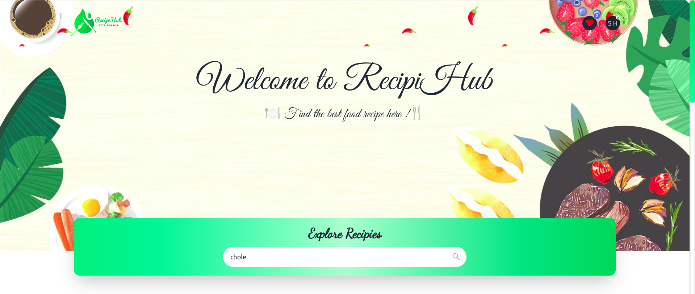
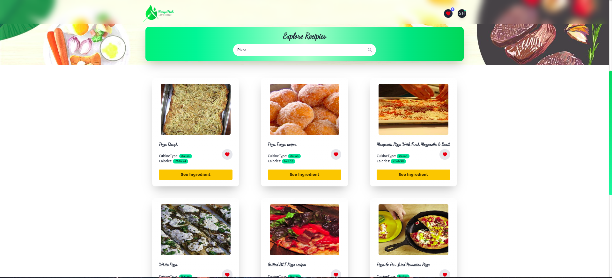
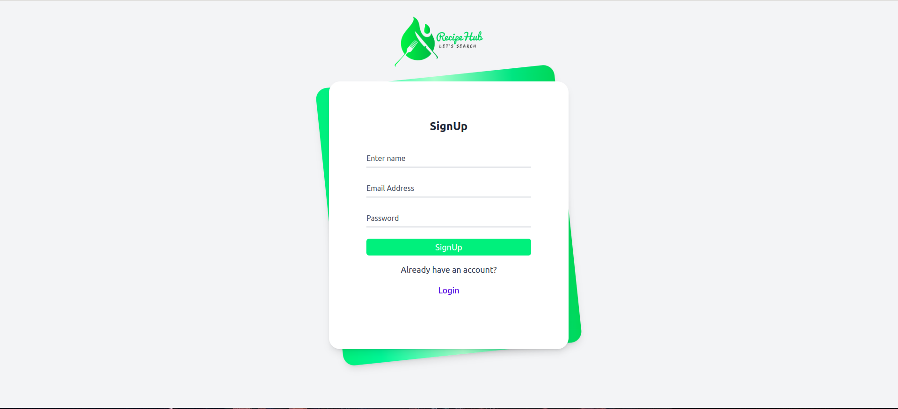
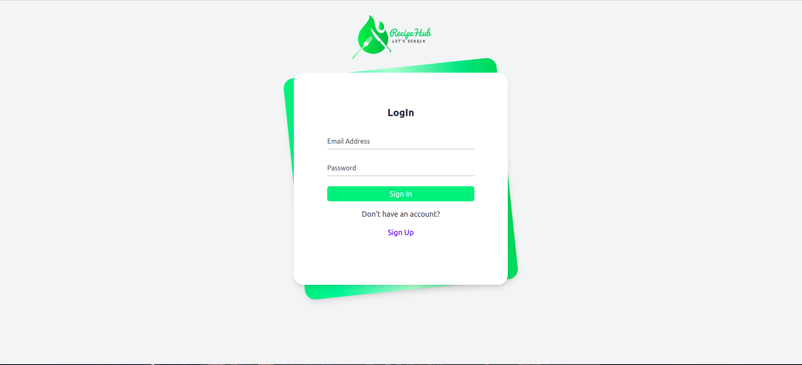

# RecipeHub App

<div  align="center">
<h1>Home Page</h1>

</div>

<div  align="center">
<h1>Result Page</h1>

</div>

<div  align="center">
<h1>Sign Up Page</h1>

</div>

<div  align="center">
<h1>Log In Page</h1>

</div>

## Table of Contents

1. Introduction
   1. Purpose
   2. Features
   3. Technologies Used
2. Getting Started
   1. Installation
   2. Configuration
3. Project Structure
   1. Components
   2. Redux Slice
   3. Firebase Integration
4. Functionality Overview

   1. User Authentication
   2. Recipe Search
   3. Recipe Listing
   4. Save Recipe

5. Conclusion

## 1. Introduction

### Purpose

The Recipe App is a web application developed using ReactJS, Tailwind CSS, and Firebase. Its main purpose is to allow users to search for recipes, list them, and save their favorite recipes to their user profile. The application also includes user authentication using Firebase's email and password authentication.

### Features

The Recipe App offers the following key features:

1. User Authentication:

   - Users can sign up or log in to the app using their email and password.

2. Recipe Search:

   - Users can search for recipes based on recipe name, ingredient and cuisine.

3. Recipe Listing:

   - The app displays a list of recipes matching the user's search query.

4. Save Recipe in User Profile:
   - Authenticated users can save their favorite recipes to their user profile.

### Technologies Used

The app utilizes the following technologies and packages:

- ReactJS: A JavaScript library for building user interfaces.
- Vite: A fast build tool and development server.
- Redux Toolkit: A package for efficient state management in React applications.
- Firebase: A cloud-based platform for building web and mobile applications.
- Lodash Debounce: A utility library to debounce function calls.
- Lottie React: A React library for working with Lottie animations.
- React Icons: A collection of popular icons for React applications.
- React Router DOM: A package for handling routing in React applications.
- React Toastify: A package for displaying toast notifications in React.
- Tailwind CSS with Daisy UI: A utility-first CSS framework with a pre-designed UI kit.

## 2. Getting Started

### Installation

To get the project up and running, follow these steps:

1. Clone the repository from GitHub:

```
git clone <repository_url>
```

2. Install the dependencies:

```
npm install

npm run dev
```

### Configuration

Before running the app, you need to set up your Firebase project and obtain the Firebase configuration. Replace the configuration in the appropriate file (e.g., `src/firebase.js`).

## 3. Project Structure

The project structure follows a standard React application layout with additional directories for components, Redux slices, and Firebase integration.

### Components

The `src/components` directory contains the React components used throughout the application. Each component is responsible for a specific UI element or functionality.

### Redux Slice

The Redux store and its slices are defined in the `src/redux` directory. The `slice` directory contains individual slices for various parts of the application state management.

### Firebase Integration

The Firebase integration code is located in the `src/firebase.js` file. This file initializes Firebase and exports the necessary functions to interact with Firebase services (e.g., authentication, saving recipes).

## 4. Functionality Overview

### User Authentication

- Users can sign up using their email and password.
- Existing users can log in to their accounts.
- Authentication state is managed using Redux for a consistent user experience across the app.
- The Firebase authentication API is used for user registration and login.

### Recipe Search

- Users can search for recipes by entering keywords in the search bar.
- The search query is debounced using Lodash to prevent excessive API calls on each keystroke.

### Recipe Listing

- The app displays a list of recipes matching the user's search query.
- Each recipe card provides essential information about the recipe, such as title, image, and a link to view the full recipe details.

### Save Recipe in User Profile

- Authenticated users can save their favorite recipes to their user profile.
- The saved recipes are associated with the user's account for easy access.

## 6. Conclusion

The Recipe App is a React-based web application that provides users with a platform to search for recipes, list them, and save their favorite recipes to their user profile. With Firebase authentication, users can create accounts and securely store their data.
This documentation aims to provide an overview of the project, its features, and the technologies used. Feel free to explore and expand upon the app's functionality based on your requirements.
